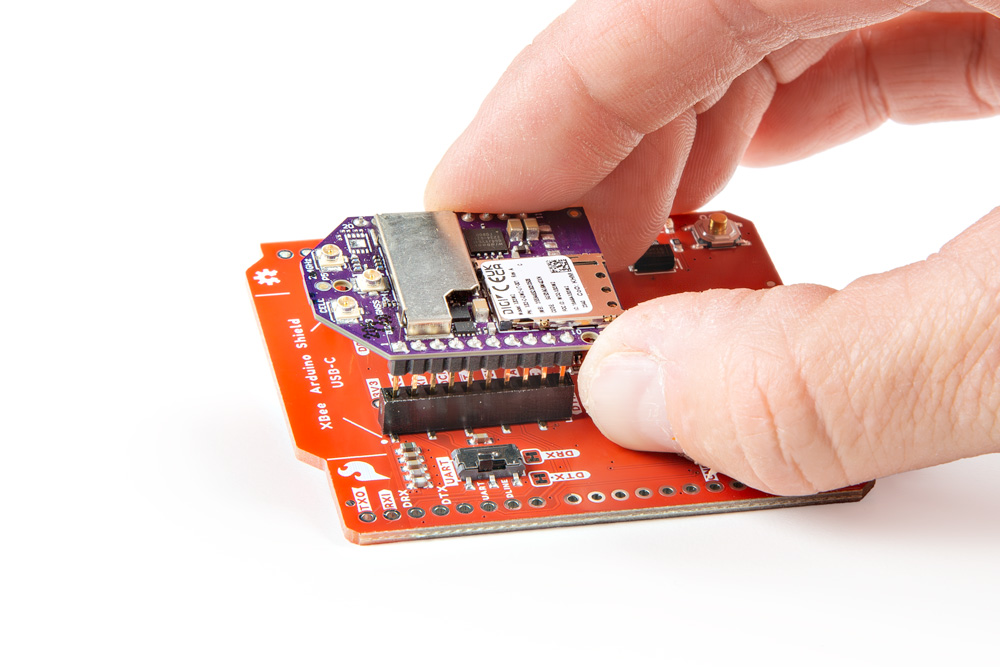

Note the white silkscreen on the Shield PCB - this will help orient your XBee as you're plugging it in. Make sure to match up the XBee's two diagonal edges with the two diagonal lines on the PCB.

<figure markdown>
[{ width="400" }](assets/img/22131-Action-1.jpg "Click to enlarge")
<figcaption markdown>Fitting the XBee into the Arduino Shield's Socket</figcaption>
</figure>
