### Digi XBee Smart Modem Socket

We've kept the Digi XBee socket consistent with the Digi XBee pinout, so this breakout board is backwards compatible. In order to take full advantage of this board, we recommend one of the newer Digi XBee boards. The [Digi XBee 3 Low-Power LTE-M/NB-IoT, GNSS, no SIM](https://www.sparkfun.com/products/22329) is a great bet. 

<figure markdown>
[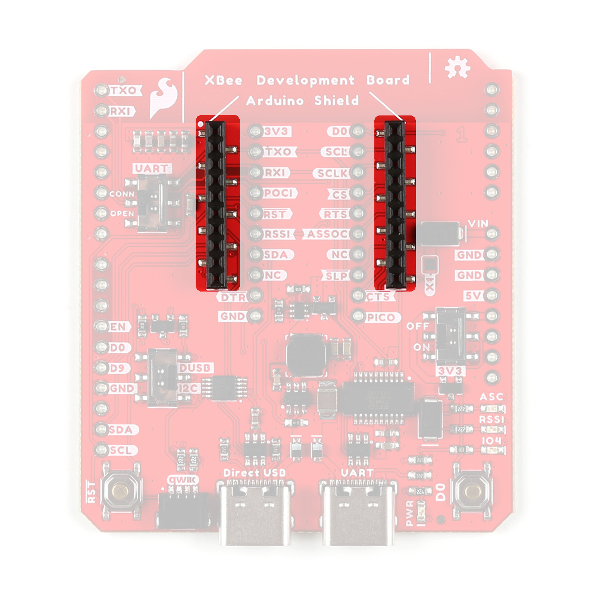{ width="400" }](assets/img/22131-XBee_Dev_Arduino_Shield-XBeeSocket.jpg "Click to enlarge")
<figcaption markdown>XBeeSocket</figcaption>
</figure>

### UART Select Switch

The RX/TX pins on this shield are connected to the upload of the standard R3/R4 board footprint. These lines go through the switch, which allows you to choose whether to talk to the Digi XBee or the digital RX/TX pins. Generally speaking, you will want to disconnect the UART lines when uploading to the R3/R4 board.

<figure markdown>
[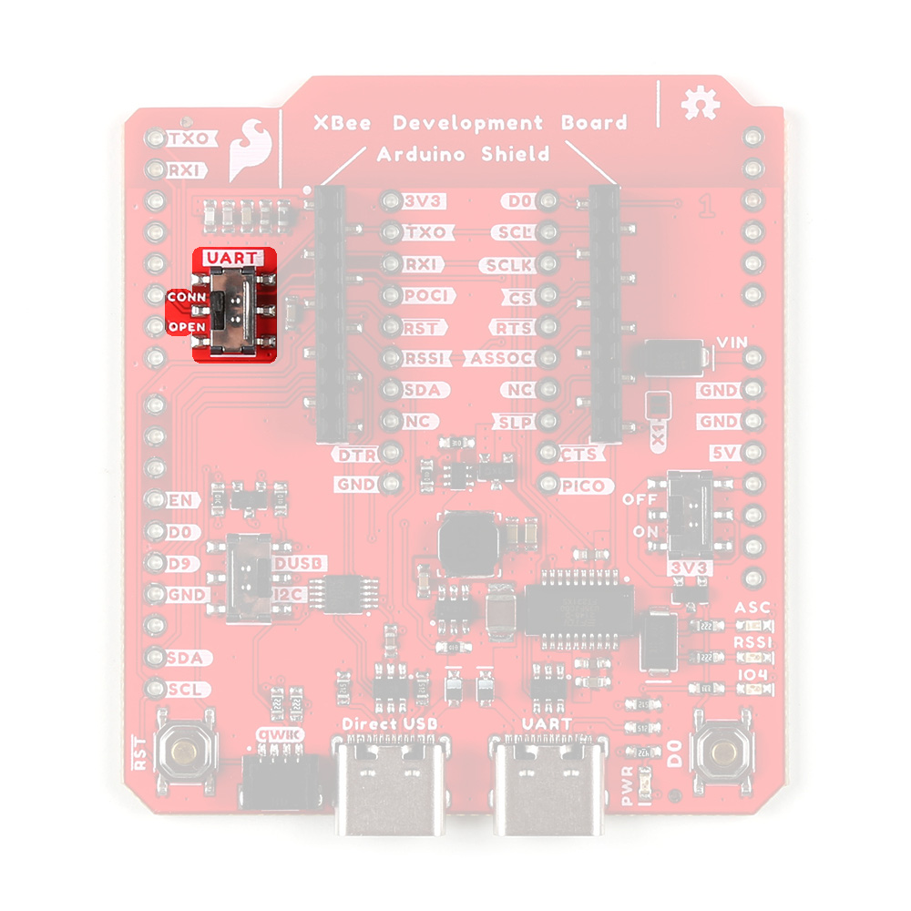{ width="400" }](assets/img/22131-XBee_Dev_Arduino_Shield-UARTSwitch.jpg "Click to enlarge")
<figcaption markdown>UART Select Switch</figcaption>
</figure>

### 3v3 Source Selection

The 3v3 source selection switch allows the user to choose whether the Digi XBee Shield is powered from the R3/R4 board or from the onboard USB-C. Some XBee 3 modules, namely those with GNSS and LTE capabilities, consume more power than can be provided through the R3/R4 board. Use the onboard USB-C connector in this case. 

<figure markdown>
[{ width="400" }](assets/img/22131-XBee_Dev_Arduino_Shield-3V3OnOffSwitch.jpg "Click to enlarge")
<figcaption markdown>3V3 Source Selection Switch</figcaption>
</figure>

### Buck Converter - AP63203

The AP63203 Buck Converter ensures appropriate power supply to the components of the board. VIN range is <b>3.8V-5.5V</b>. Output is 2A max. 

<figure markdown>
[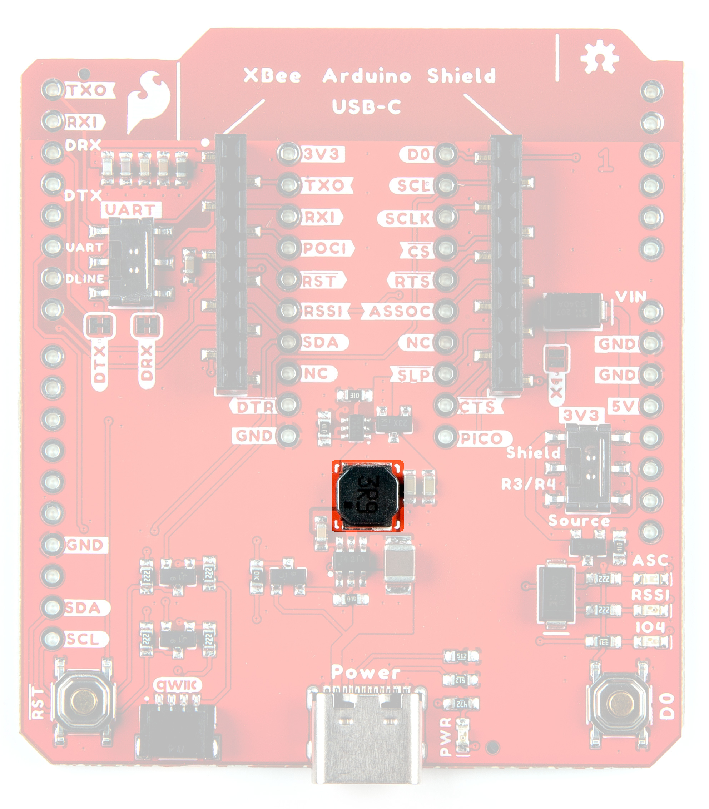{ width="400" }](assets/img/22131-XBee_Dev_Arduino_Shield-BuckConverter.jpg "Click to enlarge")
<figcaption markdown>Buck Converter - AP63203</figcaption>
</figure>

### Enable Pin Translation Circuit 

When powering via the USB-C, the enable pin (5V) allows you to turn off power to the Digi XBee. 

<figure markdown>
[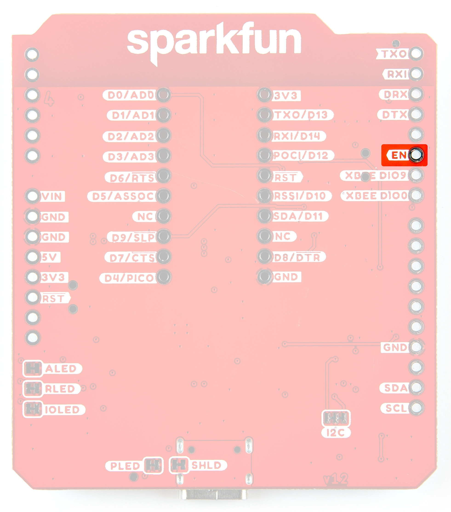{ width="400" }](assets/img/22131-XBee_Dev_Arduino_Shield-ENPin.jpg "Click to enlarge")
<figcaption markdown>Enable Pin</figcaption>
</figure>

### Qwiic Connector

The Qwiic connector on the SparkFun Digi XBee® Development Arduino Shield (Qwiic) provides power and I2C connectivity to Qwiic breakout boards. Note that the I2C functionality is not enabled by default. 

<figure markdown>
[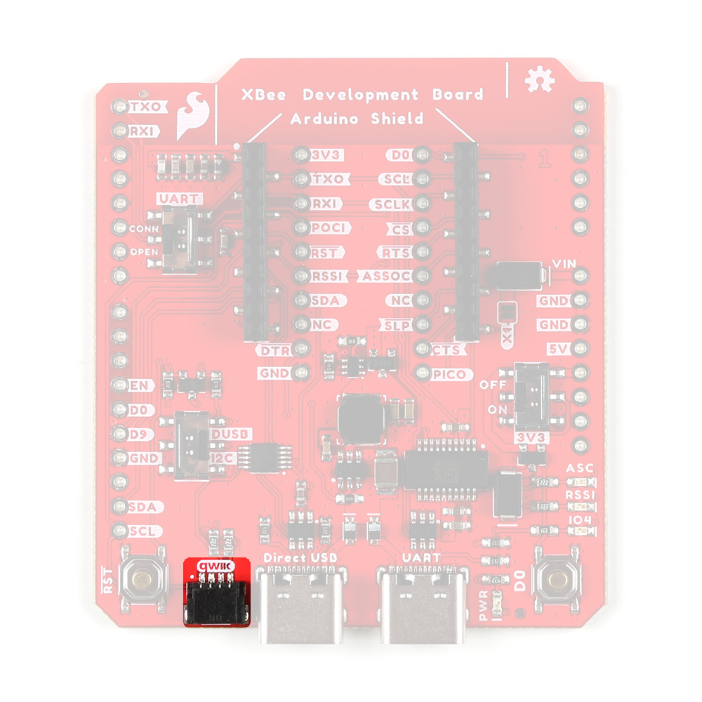{ width="400" }](assets/img/22131-XBee_Dev_Arduino_Shield-QwiicConnex.jpg "Click to enlarge")
<figcaption markdown>Qwiic Connector</figcaption>
</figure>

### Reset and D0 Buttons

There are two buttons - D0 and RST. Reset allows you to reset the board without unplugging, the D0 button is provided for user-defined functionality. 

<figure markdown>
[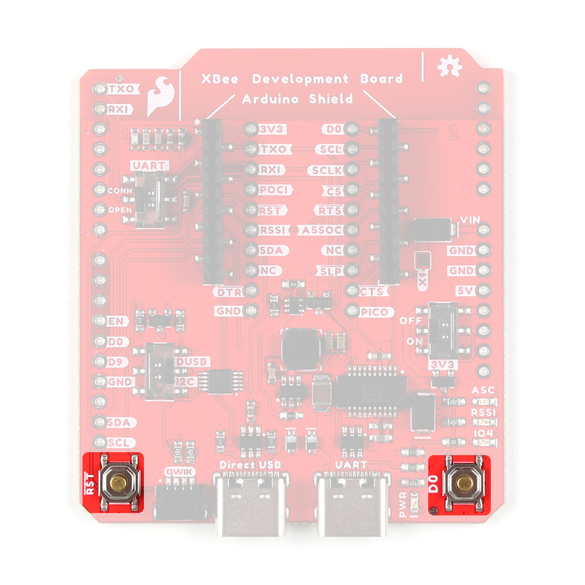{ width="400" }](assets/img/22131-XBee_Dev_Arduino_Shield-Buttons.jpg "Click to enlarge")
<figcaption markdown>Reset and D0 Buttons</figcaption>
</figure>

### LEDs

There are multiple LED indicator lights on the board: 

<figure markdown>
[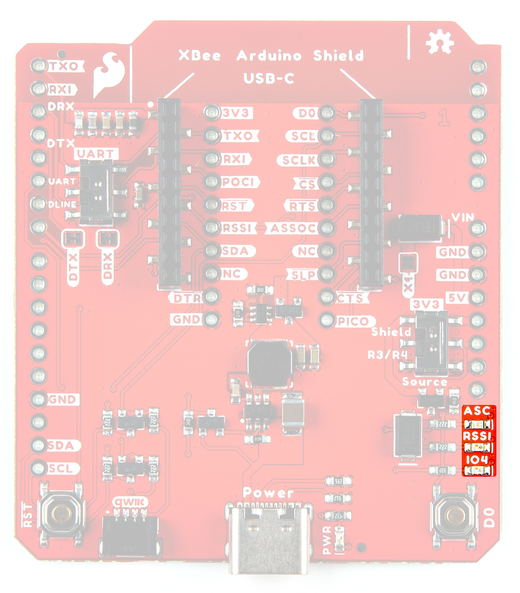{ width="400" }](assets/img/22131-XBee_Dev_Arduino_Shield-LEDs.jpg "Click to enlarge")
<figcaption markdown>LEDs</figcaption>
</figure>

#### PWR

This LED lights up when power is provided to the board. 

#### IO4

This Green LED is a user-defined LED connected to D4 of the XBee. 

#### ASC
This LED on the development board blinks when the XBee is registered to the cellular network.

| Blink | Timing | Meaning |
| --- | --- | --------- |
| On | Solid | Not joined to a mobile network |
| Double Blink | ½ second | The last TCP/UDP/SMS attempt failed. If the LED has this pattern, you may need to check DI (Remote Manager Indicator) or CI (Protocol/Connection Indication) for the cause of the error. | 
| Single blink | 1 Second | Normal Operation |

#### RSSI 
This LED is the Received Signal Strength Indicator. When configured, it reflects the received signal strength.

RSSI PWM
The RSSI/PWM output is enabled continuously, unlike other XBee products where the output is enabled for a short period of time after each received transmission. If running on the XBIB development board, DIO10 is connected to the RSSI LEDs, which may be interpreted as follows:

| PWM duty cycle | Number of LEDs turned on | Received signal strength (dBm) |
| --- | --- | --------- |
| 79.39% or more | 3 | 83 dBm or higher |
| 62.42% to 79.39% | 2 | -93 to -83 dBm |
| 45.45% to 62.42% | 1 | -103 to -93 dBm |
| Less than 45.45% | 0 | Less than -103 dBm, or no cellular network connection |

### Jumpers

### X1 Jumper

By default, the Shield is not connected to the 5V rail on the connected R3/R4 board. Soldering this jumper will connect this power path. 

<figure markdown>
[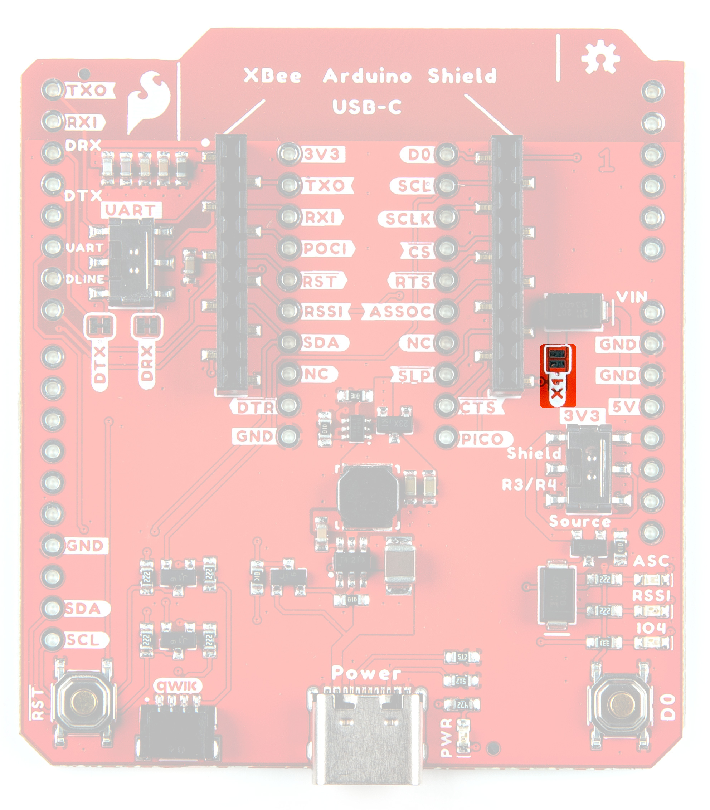{ width="400" }](assets/img/22131-XBee_Dev_Arduino_Shield-X1Jumper.jpg "Click to enlarge")
<figcaption markdown>X1 Jumper</figcaption>
</figure>

#### DTX/DRX

Cutting these jumpers will disconnect the digital RX/TX pins from your R3/R4 board. 

<figure markdown>
[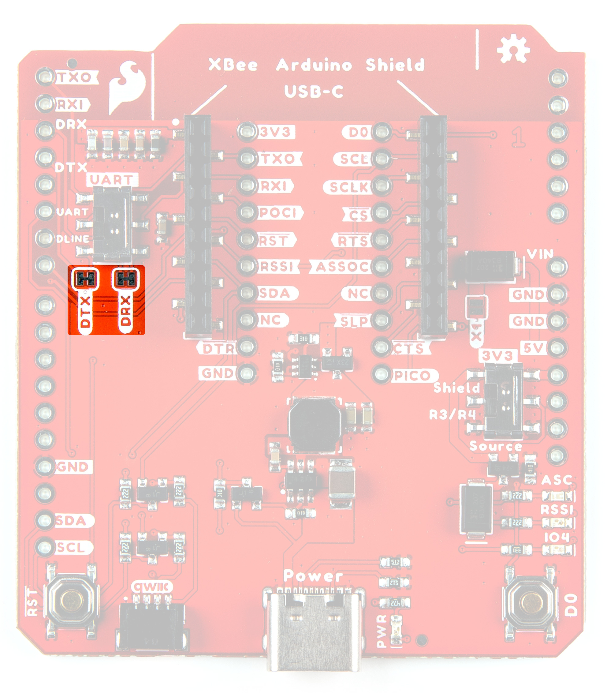{ width="400" }](assets/img/22131-XBee_Dev_Arduino_Shield-DTX-DRXJumpers.jpg "Click to enlarge")
<figcaption markdown>Digital RX/TX Jumpers</figcaption>
</figure>

#### Power 

Cutting this jumper will disconnect the Power LED on the front of the board. 

#### ALED/PLED/RLED/IOLED

If power consumption is an issue, you need to run dark, or if you just don't like the LEDs, cut the respective jumper to sever power to the LED. 

* PLED: Red
* ALED: Blue
* RLED (RSSI): Yellow
* IOLED: Green

<figure markdown>
[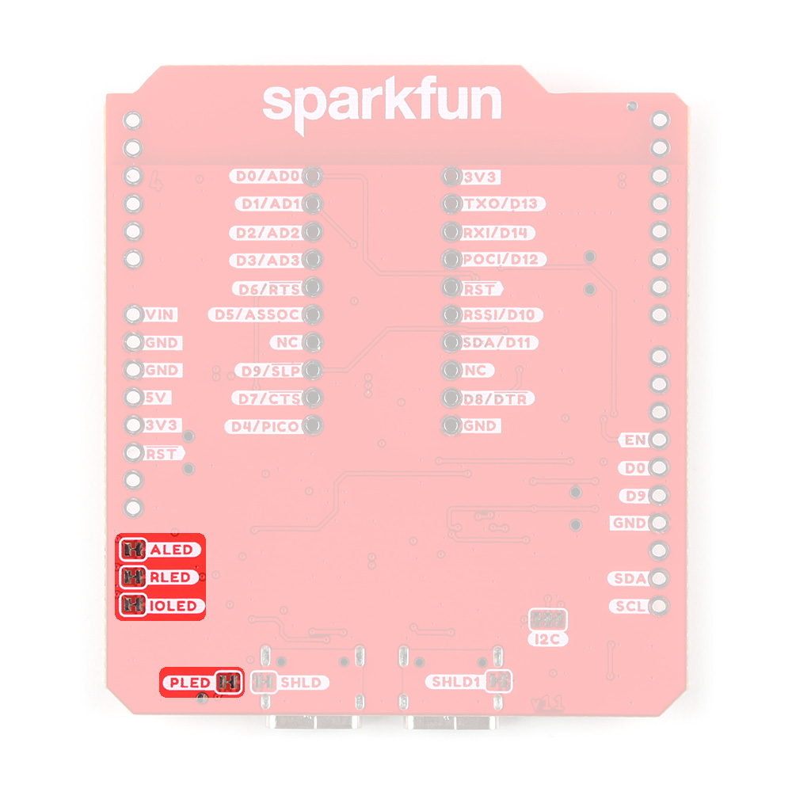{ width="400" }](assets/img/22131-XBee_Dev_Arduino_Shield-LEDJumper.jpg "Click to enlarge")
<figcaption markdown>LED Jumpers</figcaption>
</figure>

#### SHLD

For most applications, the single point grounding of the USB-C connector is sufficient. However, should you run into problems with EMI/EMC, we've provided a jumper that allow you to disconnect the USB Shield from ground.

<figure markdown>
[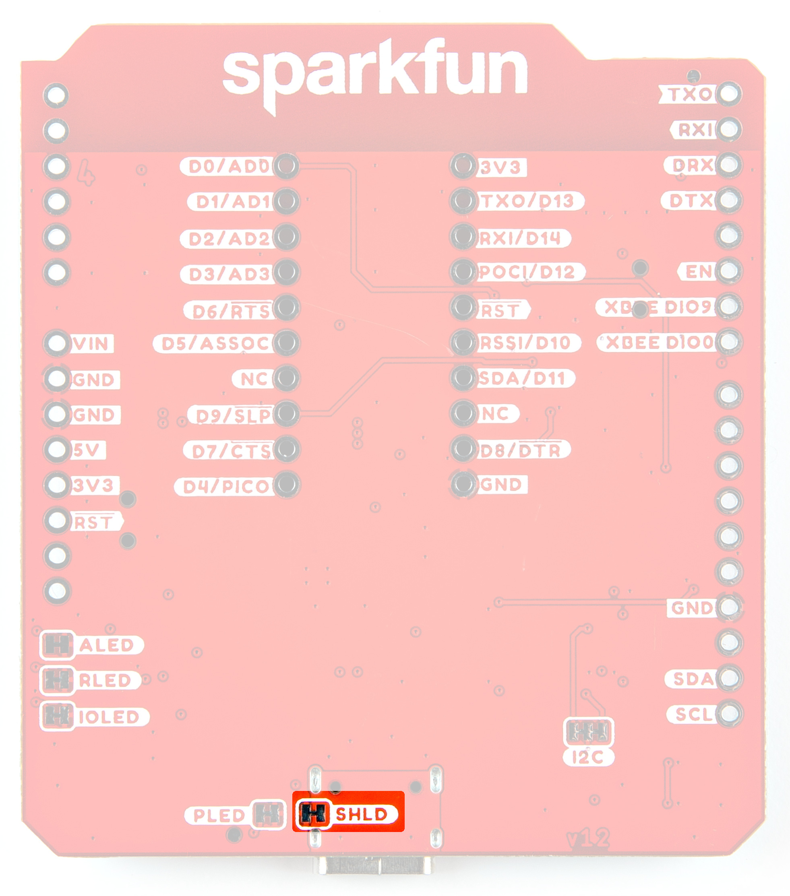{ width="400" }](assets/img/22131-XBee_Dev_Arduino_Shield-ShieldJumper.jpg "Click to enlarge")
<figcaption markdown>Shield Jumper</figcaption>
</figure>

#### I2C 

The I2C jumper pulls the SDA and SCL pins to VDD (normally 3.3V) through two 2.2K Ohm resistors. If you have multiple Qwiic devices on the same bus you may want to disable these by opening the jumper (assuming they are also operating at 3.3V logic).

<figure markdown>
[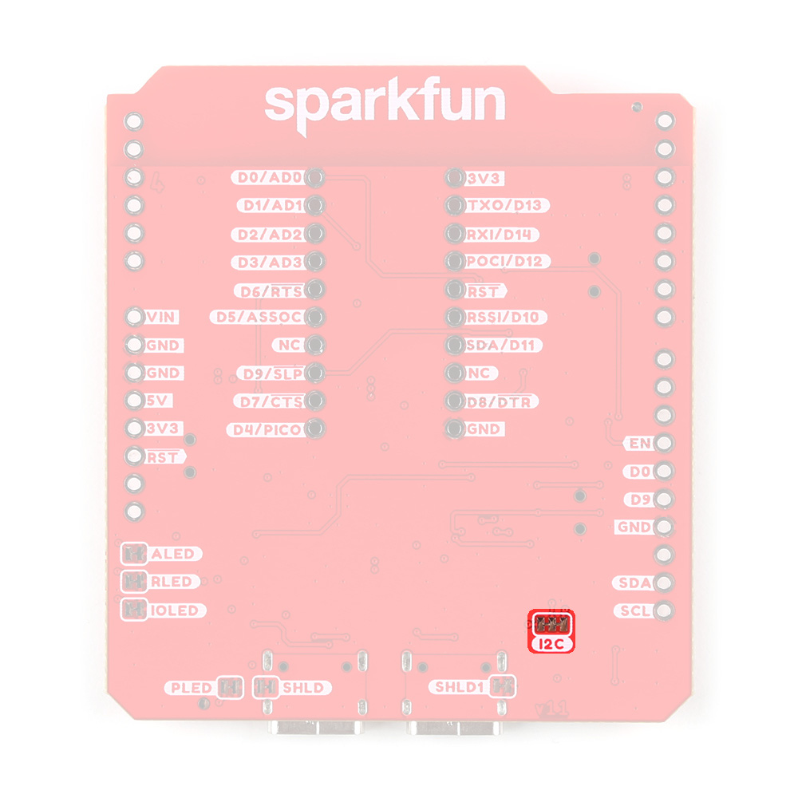{ width="400" }](assets/img/22131-XBee_Dev_Arduino_Shield-I2CJumper.jpg "Click to enlarge")
<figcaption markdown>I2C Jumper</figcaption>
</figure>

### Board Outline

The board dimensions are illustrated in the drawing below; the listed measurements are in inches.

<figure markdown>
[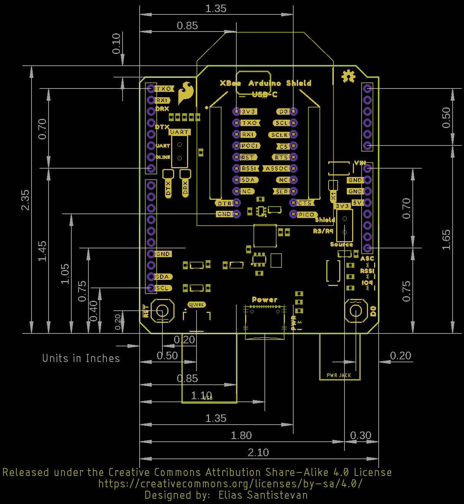{ width="400" }](assets/board_files/22131_SparkFun_XBee_Arduino_Shield_Qwiic_BoardOutline.png "Click to enlarge")
<figcaption markdown>SparkFun Digi XBee® Arduino Shield Board Dimensions</figcaption>
</figure>

??? tip "Need more measurements?"
	For more information about the board's dimensions, users can download the [Eagle files](assets/board_files/SparkFun_Digi_XBee_Arduino_Shield_Qwiic_EagleFiles.zip) for the board. These files can be opened in Eagle and additional measurements can be made with the dimensions tool.

	??? info ":octicons-download-16:{ .heart } Eagle - Free Download!"
		Eagle is a [CAD]("computer-aided design") program for electronics that is free to use for hobbyists and students. However, it does require an account registration to utilize the software.

		

		[Download from :autodesk-primary:{ .autodesk }](https://www.autodesk.com/products/eagle/free-download "Go to downloads page"){ .md-button .md-button--primary width="250px" }
		

	
	??? info ":straight_ruler: Dimensions Tool"
		This video from Autodesk demonstrates how to utilize the dimensions tool in Eagle, to include additional measurements:

		

		

		<iframe src="https://www.youtube.com/embed/dZLNd1FtNB8" title="EAGLE Dimension Tool" frameborder="0" allow="accelerometer; autoplay; clipboard-write; encrypted-media; gyroscope; picture-in-picture" allowfullscreen></iframe>
		

		

